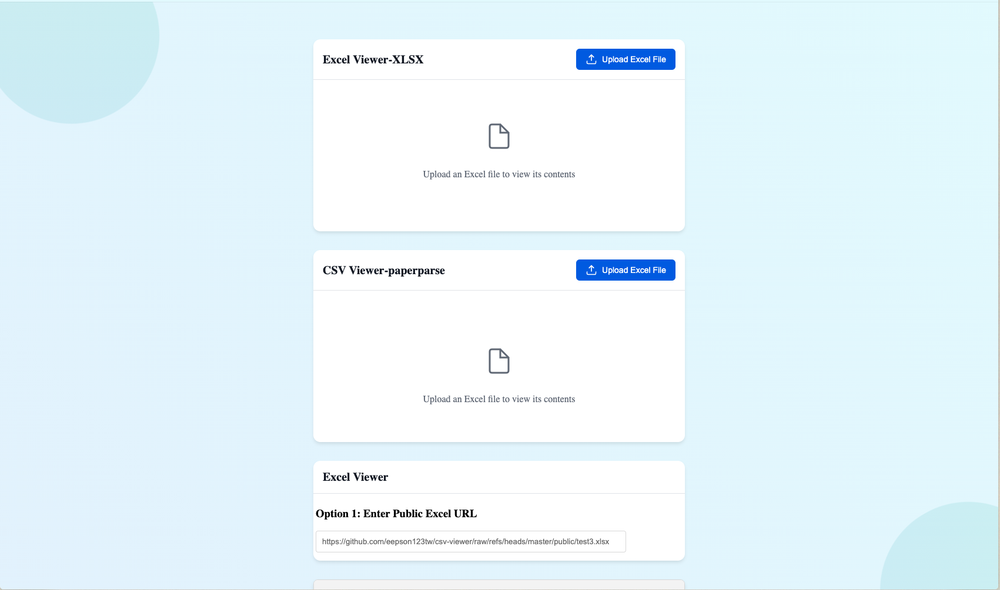

# CSV-Viewer

A web application that allows users to view and interact with Excel files stored in their Google Drive directly in the browser.



## Features

- Secure authentication with Google accounts
- Browse Excel files in your Google Drive
- Multiple viewing options:
  - Google Drive Viewer for seamless integration
  - Microsoft Office Online Viewer for rich Excel features
  - Direct iframe preview for quick access
  - PapaParse CSV Viewer for tabular data
  - XLSX Viewer for complex spreadsheets
  - FastCSV for high-performance CSV rendering
- Fallback viewing options if primary viewer fails
- No server-side storage of user data
- Responsive design for desktop and mobile use

## Technology Stack

- **Frontend**: Vue.js 3 with TypeScript
- **Authentication**: Google Identity Services (OAuth 2.0)
- **File Access**: Google Drive API
- **Data Processing**:
  - PapaParse for CSV parsing
  - SheetJS (XLSX) for Excel file handling
  - FastCSV for high-performance CSV rendering
- **Viewers**:
  - Google Drive Viewer
  - Microsoft Office Online Viewer
  - Custom CSV/Excel viewers
- **Styling**: Custom CSS
- **Containerization**: Docker with Nginx

## Prerequisites

To run or develop this application, you need:

1. Node.js (version 16 or later)
2. pnpm package manager
3. A Google Cloud Platform account with Google Drive API enabled
4. Docker (for containerized deployment)

## Setup

### Google Cloud Platform Setup

1. Create a new project in the [Google Cloud Console](https://console.cloud.google.com/)
2. Enable the Google Drive API
3. Create OAuth 2.0 credentials (Web Application type)
4. Add authorized JavaScript origins for your domains (e.g., <http://localhost:5173> for development)
5. Add authorized redirect URIs
6. Note your Client ID and API Key

### Local Development

1. Clone the repository:

   ```bash
   git clone <repository-url>
   cd google-drive-excel-viewer
   ```

2. Create a `.env` file with your Google credentials:

   ```
   VITE_GOOGLE_CLIENT_ID=your-client-id.apps.googleusercontent.com
   VITE_GOOGLE_API_KEY=your-api-key
   ```

3. Install dependencies:

   ```bash
   pnpm install
   ```

4. Install required packages for file processing:

   ```bash
   pnpm add papaparse xlsx fast-csv
   ```

5. Start the development server:

   ```bash
   pnpm dev
   ```

6. For proper authentication, set the COOP header in your development server (vite.config.ts):

   ```typescript
   export default defineConfig({
     server: {
       headers: {
         'Cross-Origin-Opener-Policy': 'same-origin-allow-popups'
       }
     }
   })
   ```

7. Open your browser and navigate to <http://localhost:5173>

### Docker Deployment

1. Build the Docker image:

   ```bash
   docker build \
     --build-arg VITE_GOOGLE_CLIENT_ID=your-client-id.apps.googleusercontent.com \
     --build-arg VITE_GOOGLE_API_KEY=your-api-key \
     -t google-drive-excel-viewer .
   ```

2. Run the container:

   ```bash
   docker run -p 8080:80 google-drive-excel-viewer
   ```

3. Access the application at <http://localhost:8080>

## Important Security Considerations

### Cross-Origin-Opener-Policy

This application requires the `Cross-Origin-Opener-Policy: same-origin-allow-popups` header for Google authentication to work correctly. The Dockerfile and Nginx configuration handle this automatically, but if you're deploying differently, make sure this header is set.

### OAuth Scope

The application uses minimal permissions, only requesting read-only access to Google Drive files:

```
https://www.googleapis.com/auth/drive.readonly
```

## How It Works

1. Users sign in with their Google account
2. The app fetches a list of Excel files from the user's Google Drive
3. When a user selects a file, the application:
   - Determines the file type (XLSX, XLS, CSV)
   - Selects the optimal viewer based on file type and size
   - Attempts multiple viewer options if the primary option fails
   - Renders the file content appropriately
4. For CSV and simple Excel files:
   - Uses PapaParse or FastCSV to parse the file
   - Renders a custom table view with sorting and filtering capabilities
5. For complex Excel files:
   - Uses SheetJS (XLSX) for advanced Excel features
   - Renders with formula support and multiple sheet navigation
6. All authentication and file access happens client-side using the user's own credentials
7. No user data or files are stored on the server

## FAQ

### Q: Why does the app need access to my Google Drive?

A: The app needs read-only permission to list and display your Excel files. It cannot modify, delete, or share your files, and it never stores your data on external servers.

### Q: Can I use this app offline?

A: No, an internet connection is required to authenticate with Google and access Drive files.

### Q: Is my data secure?

A: Yes. The app uses official Google APIs for authentication and file access. All data transfer happens over secure HTTPS connections, and the app only runs in your browser - no server has access to your files.

## Troubleshooting

### Authentication Issues

- Make sure you've added the correct domains to your Google Cloud Console OAuth configuration
- Check that the `Cross-Origin-Opener-Policy` header is correctly set
- Clear your browser cache and cookies if you encounter persistent login issues

### File Viewing Issues

- Ensure the Excel file is accessible to your Google account
- Check that your browser is not blocking iframe content
- For large files:
  - The app will attempt to use the most efficient viewer automatically
  - If a file doesn't load, try selecting a different viewer option
  - Very large Excel files (>10MB) may perform better with the Direct viewer
- For complex formatting:
  - The Microsoft Office viewer provides the best formatting support
  - Formulas and macros work best in the XLSX viewer
- For CSV files:
  - FastCSV viewer is recommended for files with many rows
  - PapaParse viewer provides better column type detection
- Try a different browser if you encounter persistent display issues

## License

[MIT License](LICENSE.md)

## Contributing

Contributions are welcome! Please feel free to submit a Pull Request.
